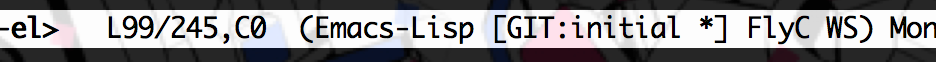

git-ps1-mode.el
===============

Global minor-mode to print `__git_ps1` .

This minor-mode print current `git` status in emacs mode-line as a mode-name.
Status text will be generated with `__git_ps1`, which is usually defined in
`"git-prompt.sh"`.

User Configuration Variables
----------------------------

* `git-ps1-mode-lighter-text-format`

  Format string for `git-ps1-mode` lighter (mode-name). By default it is set to
  `" [GIT:%s]"`.

* `git-ps1-mode-ps1-file-candidates-list`

  List of candidates that may contain \"__git_ps1\" definition.
  At the first invocation, `git-ps1-mode` searchs these files for `__git_ps1`
  definition, and set the first file to `git-ps1-mode-ps1-file`.

* `git-ps1-mode-showdirtystate`
* `git-ps1-mode-showstashstate`
* `git-ps1-mode-showuntrackedfiles`
* `git-ps1-mode-showupstream`

  Values for "GIT_PS1_SHOWDIRTYSTATE", "GIT_PS1_SHOWSTASHSTATE",
  "GIT_PS1_SHOWUNTERACKEDFILES" and "GIT_PS1_SHOWUPSTREAM" respectively.
  These variables are for configuring "git_ps1" output: see document in
  "git-prompt.sh" file for details.

License
-------

This software is licensed under MIT License.
